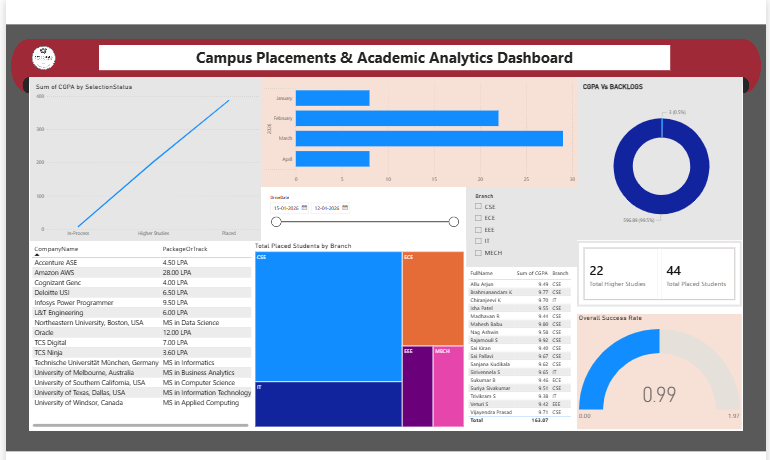
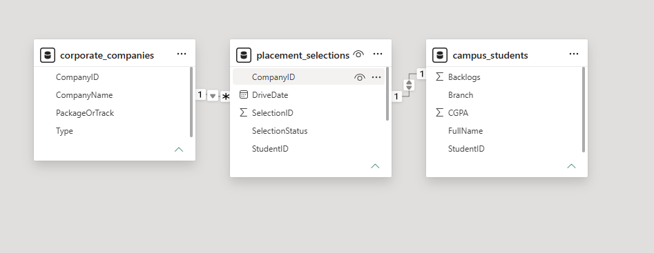

# Campus Placements & Academic Analytics Dashboard

A Power BI dashboard project for analyzing campus placements, student academics, and company hiring trends.

## Technologies Used

- Power BI
- DAX
- MySQL
- XAMPP
- Data Modeling
- SQL

## Features

- Student CGPA Analysis
- Placement Status Tracking
- Company-wise Selections
- Placement Drive Analytics
- Branch-wise Placement Insights
- Interactive Dashboard Filters
- Relational Data Modeling

## Database Tables

### campus_students
Contains:
- StudentID
- FullName
- Branch
- CGPA
- Backlogs

### corporate_companies
Contains:
- CompanyID
- CompanyName
- PackageOrTrack

### placement_selections
Contains:
- SelectionID
- StudentID
- CompanyID
- SelectionStatus
- DriveDate

## Power BI Concepts Used

- DAX Measures
- Relationships
- Data Modeling
- KPIs
- Interactive Visualizations
- Slicers and Filters

## Dashboard Preview

## How to Run

1. Import `database.sql` into MySQL using XAMPP/phpMyAdmin
2. Open `placement_dashboard.pbix`
3. Refresh the data source
4. Explore the dashboard

## Future Improvements

- Predictive placement analytics
- AI-based placement prediction
- Resume screening integration
- Real-time dashboard updates
